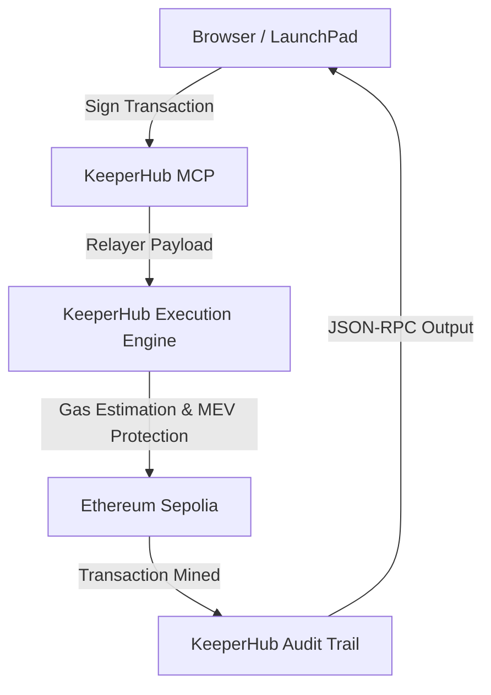

# KeeperHub LaunchPad AI 🚀

> **The easiest way to build, test and deploy KeeperHub AI agents.**

KeeperHub LaunchPad AI is the ultimate onboarding tool for developers building AI agents onchain using KeeperHub. It provides a visual dashboard to scaffold projects, diagnose environment issues, debug errors, and execute your first transaction in minutes.

Built for the **KeeperHub Agents Onchain Hackathon** with a special focus on winning the **Best Onboarding UX Improvement** bounty.

## 🌟 Features

*   **AI Project Scaffolder**: Generate ready-to-deploy templates for DAO voters, NFT minters, DeFi bots, and more.
*   **System Doctor**: Instantly verify your Node.js version, wallet connection, KeeperHub MCP, and API keys.
*   **One-Click First Transaction**: A visual workflow builder that takes you from agent decision to onchain execution without writing a line of code.
*   **AI Error Explainer**: Paste cryptic RPC errors and get human-readable explanations with one-click fixes.
*   **Interactive Tutorial**: Embedded documentation that guides you through the entire lifecycle of a KeeperHub transaction.

## 🏗 Architecture

The LaunchPad utilizes a robust relayer pattern to ensure transactions are safely routed through the KeeperHub Execution Layer.



## 🎥 Demos

*(Replace these placeholders with real GIFs for the final submission!)*

*   **1. Setup & Environment Doctor**: ``
*   **2. Template Generation**: ``
*   **3. First Transaction (KeeperHub MCP)**: ``
*   **4. AI Error Explainer**: ``

## 🚀 Quick Start

```bash
# Clone the repository
git clone https://github.com/your-username/keeperhub-launchpad-ai.git

# Navigate to the project
cd keeperhub-launchpad-ai

# Install dependencies
npm install

# Start the LaunchPad dashboard
npm run dev
```

Open [http://localhost:3000](http://localhost:3000) in your browser.

## 🛠 Architecture

*   **Frontend**: Next.js 15, React 19, Tailwind CSS v4, shadcn/ui, Framer Motion
*   **Execution Layer**: KeeperHub MCP / CLI integration
*   **Wallet**: MetaMask / WalletConnect compatible abstractions

## 💻 CLI Helpers

You can also run our standalone diagnostic tool:

```bash
npx keeperhub-doctor
```
*(See `scripts/keeperhub-doctor.js` for implementation)*

## 🤝 Contributing

We'd love to see KeeperHub LaunchPad AI become the official `create-keeperhub-app`! Check out our open PR ideas in the `PR_IDEAS.md` file.

## 📜 License

MIT
